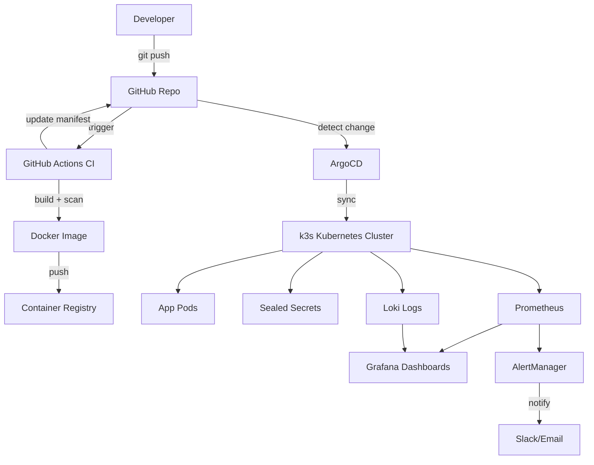

# Archnet Architecture

```mermaid
flowchart TD
    A[Developer] -->|git push| B[GitHub Repo]
    B -->|trigger| C[GitHub Actions CI]
    C -->|build + scan| D[Docker Image]
    D -->|push| E[Container Registry]
    C -->|update manifest| B
    B -->|detect change| F[ArgoCD]
    F -->|sync| G[k3s Kubernetes Cluster]
    G --> H[App Pods]
    G --> I[Sealed Secrets]
    G --> J[Prometheus]
    J --> K[Grafana Dashboards]
    J --> L[AlertManager]
    L -->|notify| M[Slack/Email]
    G --> N[Loki Logs]
    N --> K
```
